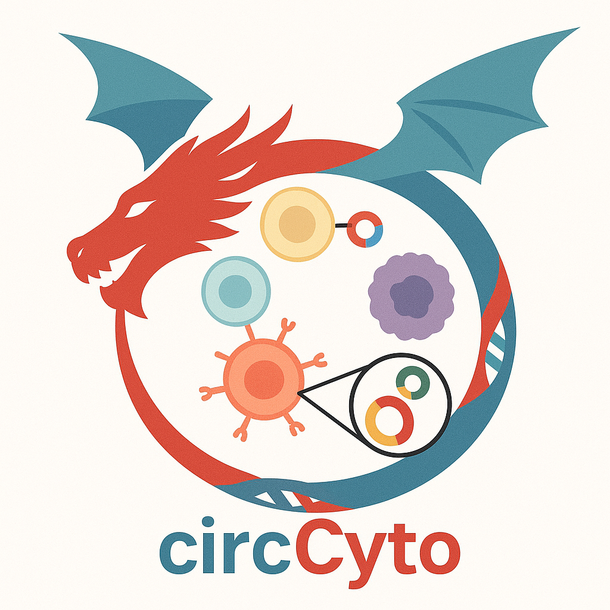

<p align="center">
  
</p>

<p align="center">
  <a href="https://github.com/liuifrec/circyto/releases">
  
  </a>
[](LICENSE)
[](https://www.python.org/)
</p>

## circyto


A unified CLI framework for **single-cell circRNA detection**, detector orchestration, **circRNA × cell matrix generation**, and **multimodal export**.

---

## What it is

`circyto` provides a reproducible command-line interface over multiple circRNA detectors (currently **CIRI-full** and **find-circ3**) and standardizes outputs for downstream single-cell analysis (Scanpy / Seurat / scVI).

If you're new, your fastest path is:

1) install `circyto` + one detector  
2) run the bundled chr21 smoke test  
3) collect a `circ_counts.mtx` matrix  
4) move on to your own reference/manifest

---

## Install

### System prerequisites (high level)

You will need:

- **Python 3.10+**
- For `find-circ3` workflows: **bowtie2** and **samtools**
- For `ciri-full` workflows: **bwa** and **Java (JRE)**

> Tip: if something fails with “command not found”, jump to `docs/getting_started.md#external-dependencies`.

### Install `circyto` from source

```bash
git clone https://github.com/liuifrec/circyto
cd circyto

# (recommended) use a virtualenv
python -m venv .venv
source .venv/bin/activate

pip install -U pip
pip install -e .
```

### Install at least one detector

#### Option A: find-circ3 (recommended for your first smoke test)

```bash
git clone https://github.com/liuifrec/find_circ3.git
pip install -e ./find_circ3

find-circ3 --help
```

#### Option B: CIRI-full

`circyto` expects the **CIRI-full JAR** to be available under `tools/` (see repository `tools/` layout).
You also need `bwa` and a Java runtime.

See: `docs/detectors.md#ciri-full`.

---

## Minimal example (bundled chr21 smoke test)

This repository includes a small chr21 reference (`ref/chr21.fa`) and a small manifest (`manifest_2.tsv`) intended for smoke testing.

### 1) Run a detector on the bundled manifest

```bash
circyto run-batch \
  --detector find-circ3 \
  --manifest manifest_2.tsv \
  --outdir work/find_circ3_chr21 \
  --ref-fa ref/chr21.fa \
  --threads 4 \
  --parallel 2
```

### 2) Collect a circRNA × cell MatrixMarket matrix

```bash
mkdir -p work/find_circ3_chr21_matrix

circyto collect-matrix \
  --detector find-circ3 \
  --indir work/find_circ3_chr21 \
  --matrix work/find_circ3_chr21_matrix/circ_counts.mtx \
  --circ-index work/find_circ3_chr21_matrix/circ_index.txt \
  --cell-index work/find_circ3_chr21_matrix/cell_index.txt
```

**Expected outcome**: `circ_counts.mtx` exists and has non-zero entries.

---

## Next steps

- **Getting started guide** (full workflows, references/manifests): `docs/getting_started.md`
- **Detector catalog** (what each detector needs & produces): `docs/detectors.md`
- **CLI contract** (“where do detector/outdir go?”): `docs/cli_policy.md`
- **Project strategy & milestones**: `ROADMAP.md`

---

## Citation

A methods manuscript is under preparation. In the meantime, please cite this repository:

> Liu, Y.-C. et al. “circyto: a unified CLI for single-cell circRNA detection and multimodal matrices.” GitHub repository: https://github.com/liuifrec/circyto
