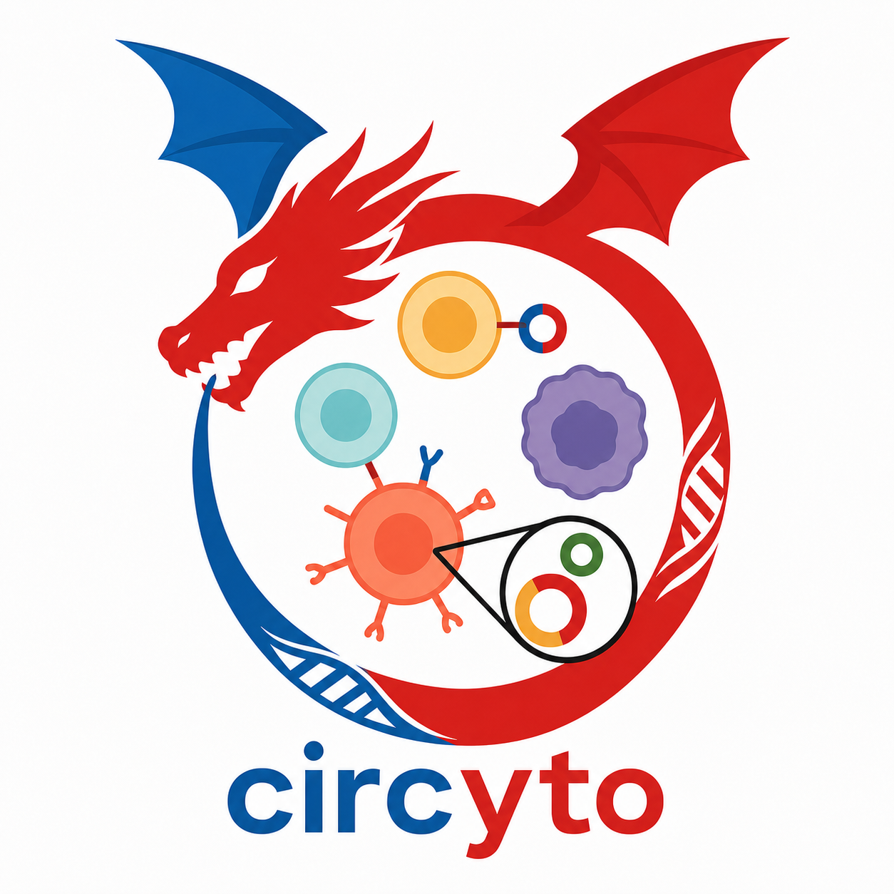

<p align="center">
  
</p>

<p align="center">
  <a href="https://github.com/liuifrec/circyto/releases">
  
  </a>
  <a href="https://github.com/liuifrec/circyto/blob/main/LICENSE">
  
  </a>
  <a href="https://pypi.org/project/circyto/"></a>
</p>

# circyto

A CLI/scverse-compatible framework for single-cell circular RNA detection, annotation, and multimodal integration from full-length single-cell RNA-seq and full-length single-cell multi-omic data.

The main output is a circRNA-by-cell matrix, with `h5ad` export and optional RNA+circ MuData integration. Capability boundaries are intentionally narrow:

| Input mode | Current support |
| --- | --- |
| Short-read full-length single-cell RNA-seq | CircRNA detection, collection, annotation, QC, and scverse export; validated workflows use CIRI3 while the public CLI remains experimental. |
| Generic single-cell Nanopore cDNA | Experimental alignment, QC, and provenance interoperability only; it does not call or validate circRNAs. |
| CIRI-long RCRT/circRNA-enriched reads | Optional experimental `circyto ciri-long` adapter for chemistry-confirmed RCRT libraries; ordinary ONT cDNA is rejected. |

A minimal full-length workflow shape is:

```bash
circyto workflow full-length-circrna \
  --manifest manifest.tsv \
  --outdir work/full_length \
  --protocol ramda \
  --genome-fasta ref/genome.fa \
  --gtf ref/genes.gtf \
  --export-h5ad
```

Run `circyto doctor` and `circyto detectors` first to distinguish core package readiness from optional workflow-tool readiness.

## Status

`circyto` `v0.10.0` is the current experimental milestone.

- The validated pooled SMART-Seq3 end-to-end path is FASTQs -> demux -> manifest selection -> STAR alignment -> BWA rescue for CIRI3 STAR tuple mode -> CIRI3 detection -> matrix collection -> QC -> `h5ad` export -> circRNA annotation.
- The validated single-end full-length RamDA/scRR path is FASTQ -> BWA-MEM -> CIRI3 direct SAM -> matrix -> `h5ad`.
- The validated paired-end full-length RamDA/scRR path is FASTQ pair -> STAR -> CIRI3 STAR tuple mode -> matrix -> `h5ad`, with `--allow-paired-ramda` required for explicit opt-in. `--experimental-paired-ramda` remains accepted as a deprecated alias.
- The validated scRR integration path now includes processed GEO CNV import, GSM-to-biological-cell mapping, and IMR90 23-cell tri-modal RNA+circ+CNV MuData.
- The HAP1 scRR DNA replication timing/state branch has a lightweight `rt` importer and RNA+circ+RT merge path; real processed-file validation is pending local availability of the GSE278952 HAP1 DNA tables.
- SComatic interoperability has been validated as a technical path for RNA-derived candidate variant signals on HAP1 batch10, but it remains exploratory and is not the primary scRR DNA modality.
- The experimental SMART-Seq3 workflow has been validated end to end on real E-MTAB-8735 diySpike data.
- Generic Nanopore cDNA support is experimental interoperability only (alignment/QC/provenance, never circRNA validation); CIRI-long support is a separate optional RCRT/circRNA-enriched workflow.
- Core detector integrations remain heterogeneous and should still be treated as experimental interfaces rather than a frozen `v1.0` contract.
- Default CI is now a clean Python 3.12 `pytest -q .` run; external detector integrations are gated and skipped by default.

A concise benchmark-oriented summary of validated and exploratory workflow tiers is available in [`docs/validated_workflows_summary.md`](docs/validated_workflows_summary.md).

Manuscript-facing reproducibility plans and reusable summary scripts are organized under [`manuscript/`](manuscript/) and [`scripts/manuscript/`](scripts/manuscript/). Command and schema references are available in [`docs/manuscript_reproducibility.md`](docs/manuscript_reproducibility.md), [`docs/modality_schema.md`](docs/modality_schema.md), [`docs/mudata_schema.md`](docs/mudata_schema.md), and [`docs/host_gene_provenance.md`](docs/host_gene_provenance.md).

### Current Capability Table

| Modality | Current status | Notes |
| --- | --- | --- |
| `rna` | validated | RNA profile import and MuData RNA modality for completed full-length workflows |
| `circ` | validated | CIRI3-backed circRNA matrices, QC, `h5ad`, and MuData circ modality |
| `cnv` | validated for processed scRR GEO summaries | `import-scrr-cnv` writes `cnv.h5ad`; IMR90 full23 tri-modal MuData validated at 50 kb |
| `rt` | implemented for processed scRR replication timing/state summaries | `import-scrr-rt` writes `rt.h5ad`; intended for HAP1 GSE278952 processed DNA RT/state tables |
| `candidate_snv` | exploratory / optional | `merge-scomatic` exports RNA-derived candidate variant signals only; not orthogonally confirmed DNA variant calls |

| Dataset / run | Current validation state |
| --- | --- |
| IMR90 full23 | RNA + circ + CNV tri-modal MuData validated |
| HAP1 batch10 | RNA + circ workflow validated; SComatic BaseCellCounter, Step1, Step2, and normalization technical smoke validated |
| HAP1 processed RT | `rt` importer and RNA+circ+RT merge implemented with synthetic tests; real GSE278952 processed-file import pending |
| HAP1 full | pending full FASTQ download and full workflow run |

## Installation

### Source install

```bash
git clone https://github.com/liuifrec/circyto
cd circyto

conda env create -f environment.yml
conda activate circyto
python -m pip install -e .
```

The repo-root [environment.yml](environment.yml) is the supported baseline for source installs. It provides the Python scientific stack and CLI dependencies, but it intentionally does not install external detector executables.

### External tools

Install only the external tools needed for the workflow you plan to run:

- `STAR` for STAR-based alignment preparation
- `bwa` for CIRI3 rescue alignment and BWA-based workflows
- `samtools` for alignment handling
- `java` >= 12 for the bundled CIRI3 jar; Java 17 recommended
- detector-specific tools such as `bowtie2` or `find-circ3` only when using those detector paths

For bundled CIRI3 direct mode, supported environment variables include:

- `CIRCYTO_CIRI3_HOME`
- `CIRCYTO_CIRI3_JAR`
- `CIRCYTO_CIRI3_JAVA`
- `CIRCYTO_CIRI3_EXTRA_ARGS`
- `CIRCYTO_CIRI3_CMD_TEMPLATE`

Expected vendored layout:

```text
tools/
  CIRI3/
    CIRI3_Java_*.jar
```

## Quick checks

After installation, verify the package and runtime detection:

```bash
circyto --version
circyto doctor
circyto detectors
```

What these checks mean:

- `circyto --version` should report `0.10.0`.
- `circyto doctor` checks Python/runtime setup and external dependencies.
- `circyto detectors` reports detector readiness and required external tools.

## Core workflows

### Current CLI map

Recommended user-facing entry points:

| Command | Purpose | Main use case | Status |
| --- | --- | --- | --- |
| `circyto workflow smartseq3-ciri3` | One-command SMART-Seq3 workflow | pooled Smart-seq3 / E-MTAB-8735-style runs | validated workflow, still versioned as experimental CLI |
| `circyto workflow full-length-circrna` | One-command full-length circRNA workflow | RamDA, Shin-RamDA, human scRR per-cell FASTQs | validated single-end and paired-end routes, still versioned as experimental CLI |
| `circyto prepare-public-dataset` | Reproducible planning artifacts for benchmark datasets | benchmark planning without downloading large files | planning utility |

Advanced / lower-level entry points:

| Command | Purpose | Main use case | Status |
| --- | --- | --- | --- |
| `circyto run-ciri3` | Protocol-aware alignment-first CIRI3 runner | advanced manual RamDA / Shin-RamDA / SMART-Seq3 CIRI3 execution | advanced |
| `circyto prepare-alignment-cache` | Build reusable STAR/BWA alignment artifacts | alignment-first multi-step runs | advanced |
| `circyto run-detector-from-alignments` | Run detector from prepared alignment manifest | manual alignment-first runs | advanced |
| `circyto collect-matrix` | Build circRNA matrix from per-cell outputs | manual collection / detector comparisons | advanced |
| `circyto add-rna-profile` | Add a lightweight post-hoc RNA profile to a completed workflow folder | completed workflow reuse without rerunning alignment or detection | advanced |
| `circyto cleanup-workflow` | Remove regenerable workflow-owned intermediates from a completed workflow folder | post-run disk reclamation with integrity checks | advanced |
| `circyto import-scrr-cnv` | Import processed scRR GEO CNV state and mappability-normalized summaries | scRR DNA CNV modality construction | validated for processed GEO summaries |
| `circyto import-scrr-rt` | Import processed scRR replication timing/state summaries | HAP1 scRR DNA RT modality construction | implemented with synthetic tests |
| `circyto build-scrr-cell-map` | Build GSM -> RNA/DNA title -> canonical biological-cell map from GEO SOFT metadata | scRR RNA/DNA cell pairing | validated on GSE278958 metadata |
| `circyto remap-scrr-mudata-obs` | Remap RNA/circ MuData obs IDs from GSM to canonical scRR cell IDs | preparing RNA/circ MuData for CNV merge | validated on IMR90 full23 |
| `circyto merge-scrr-cnv` | Merge remapped RNA/circ MuData with `cnv.h5ad` | tri-modal RNA+circ+CNV MuData | validated on IMR90 full23 |
| `circyto merge-scrr-rt` | Merge remapped RNA/circ MuData with `rt.h5ad` | tri-modal RNA+circ+RT MuData | implemented with synthetic tests |
| `circyto prepare-scomatic-input` | Prepare full-length RNA alignments and SComatic cell annotations | Smart-seq2/3, RamDA, ShinRamDA, scRR RNA SComatic interoperability | RNA-derived candidate variant signals interoperability |
| `circyto run-scomatic` | Write and optionally execute external SComatic command plans | BaseCellCounter plus optional Step1/Step2 | exploratory; external execution requires explicit `--execute` |
| `circyto import-scomatic` | Import SComatic Step1/Step2 or candidate tables | normalized `scomatic_candidate_summary.tsv` | RNA-derived candidate variant signals interoperability |
| `circyto merge-scomatic` | Merge normalized candidates as `candidate_snv` | RNA+circ+candidate_snv MuData | exploratory / optional |
| `circyto export-scomatic-inputs` | Emit interoperability tables for external SComatic runs | exploratory circRNA/SNV interoperability | exploratory |
| `circyto join-circ-snv-summary` | Join circ summaries with exploratory SComatic candidate tables | exploratory circRNA/SNV summaries | exploratory |

SComatic-related functionality remains exploratory. Use conservative terms such as `RNA-derived candidate variant signals`, and see [`docs/scomatic_circrna_study_design.md`](docs/scomatic_circrna_study_design.md) for the future integrated study design.

### Examples

Smart-seq3 one-command workflow:

```bash
circyto workflow smartseq3-ciri3 \
  --read1 raw/Smartseq3.diySpike.R1.fastq.gz \
  --read2 raw/Smartseq3.diySpike.R2.fastq.gz \
  --index1 raw/Smartseq3.diySpike.I1.fastq.gz \
  --index2 raw/Smartseq3.diySpike.I2.fastq.gz \
  --annotation metadata/Smartseq3.diySpike.sample_annotation.normalized.tsv \
  --cell-id-column cell_id \
  --index1-column index1 \
  --index2-column index2 \
  --ref-fa /path/to/hg38.fa \
  --star-index /path/to/star_index \
  --outdir work/diySpike_workflow_all192 \
  --threads 24 \
  --resume \
  --export-h5ad
```

Single-end RamDA/scRR full-length workflow:

```bash
circyto workflow full-length-circrna \
  --manifest manifest_single.tsv \
  --outdir work/full_length_single \
  --protocol ramda \
  --genome-fasta /path/to/hg38.fa \
  --gtf /path/to/gencode.v38.annotation.gtf \
  --export-h5ad
```

Paired-end scRR workflow:

```bash
circyto workflow full-length-circrna \
  --manifest manifest_paired.tsv \
  --outdir work/full_length_paired \
  --protocol ramda \
  --genome-fasta /path/to/hg38.fa \
  --gtf /path/to/gencode.v38.annotation.gtf \
  --star-index /path/to/star_index \
  --allow-paired-ramda \
  --export-h5ad
```

Public dataset planning:

```bash
circyto prepare-public-dataset \
  --dataset-id E-MTAB-8735 \
  --protocol smartseq3 \
  --download-method ena \
  --max-runs 2 \
  --dry-run \
  --outdir work/public_emtab8735_plan
```

### 1. SMART-Seq3 to CIRI3 end-to-end workflow

This is the main pooled SMART-Seq3 workflow. The command below is a realistic example shape for a real dataset run; the paths are examples and should be replaced with your own files.

```bash
circyto workflow smartseq3-ciri3 \
  --read1 raw/Smartseq3.diySpike.R1.fastq.gz \
  --read2 raw/Smartseq3.diySpike.R2.fastq.gz \
  --index1 raw/Smartseq3.diySpike.I1.fastq.gz \
  --index2 raw/Smartseq3.diySpike.I2.fastq.gz \
  --annotation metadata/Smartseq3.diySpike.sample_annotation.normalized.tsv \
  --cell-id-column cell_id \
  --index1-column index1 \
  --index2-column index2 \
  --ref-fa /path/to/hg38.fa \
  --star-index /path/to/star_index \
  --outdir work/diySpike_workflow_all192 \
  --threads 24 \
  --parallel 1 \
  --chunk-size 1 \
  --resume \
  --export-h5ad
```

What it does:

- demultiplexes pooled SMART-Seq3 reads with `circyto demux smartseq3`
- writes selected manifests under `OUTDIR/manifests/`
- prepares STAR+CIRI3 hybrid alignment artifacts
- runs CIRI3 from the alignment manifest
- collects a circRNA matrix with QC tables
- exports `OUTDIR/anndata/circ_counts.h5ad`
- writes `workflow_summary.json`

Main outputs:

- `demux/`
- `manifests/`
- `align/`
- `ciri3/`
- `matrix/`
- `qc/`
- `anndata/`
- `mudata/` when `--export-mudata` is enabled
- `workflow_summary.json`

### 2. Low-level alignment-first CIRI3 workflow

Use this path when you want explicit control over alignment preparation, detector execution, and matrix collection. The commands below are example command shapes; replace paths and references with your own files.

```bash
circyto prepare-alignment-cache \
  --manifest manifest.tsv \
  --aligner star \
  --detector ciri3 \
  --ref-fa /path/to/hg38.fa \
  --outdir work/alignment_cache \
  --extra-flags "--genomeDir /path/to/star_index --readFilesCommand zcat"

circyto run-detector-from-alignments \
  --detector ciri3 \
  --manifest work/alignment_cache/alignment_manifest.tsv \
  --outdir work/ciri3_run \
  --ref-fa /path/to/hg38.fa

circyto collect-matrix \
  --detector ciri3 \
  --indir work/ciri3_run \
  --outdir work/ciri3_matrix
```

Notes:

- `prepare-alignment-cache --aligner star --detector ciri3` uses the official STAR + BWA rescue hybrid contract implemented for CIRI3.
- For CIRI3 STAR tuple mode, the alignment manifest must carry STAR outputs plus `bwa_sam`.
- `collect-matrix` is the current unified matrix collector; older `collect` examples are not the recommended public interface.

### 3. Full-length RamDA / Shin-RamDA / scRR workflow

Use `circyto workflow full-length-circrna` for per-cell full-length total RNA manifests.

Route selection:

- single-end RamDA / Shin-RamDA / scRR rows use `BWA-MEM -> direct SAM -> CIRI3`
- paired-end RamDA / Shin-RamDA / scRR rows use `STAR -> CIRI3 STAR tuple mode`
- paired-end real execution requires `--allow-paired-ramda`
- `--experimental-paired-ramda` still works as a deprecated alias

See [`docs/full_length_workflow.md`](docs/full_length_workflow.md) for the full manifest contract and workflow behavior.

### 4. CircRNA annotation

Annotate the workflow `circ_qc.tsv` against known circRNA databases. The command shape below is current and verified; the database paths are examples.

```bash
circyto annotate-circs \
  --circ-table work/diySpike_workflow_all192/qc/circ_qc.tsv \
  --annotation-db "name=circatlas;path=path/to/circAtlas_v3.tsv;chrom=seqnames;start=donor;end=acceptor;strand=bsj_strand;id=atlas_id;host_gene=gene_symbol;extra=tissue" \
  --annotation-db "name=circsc;path=path/to/circSC_normalized.tsv;chrom=chromosome;start=start_1based;end=end_1based;id=circsc_id;host_gene=gene_label;extra=celltype" \
  --out work/diySpike_workflow_all192/qc/circ_qc.annotated.tsv \
  --summary-out work/diySpike_workflow_all192/qc/annotation_summary.json \
  --update-h5ad work/diySpike_workflow_all192/anndata/circ_counts.h5ad
```

Annotation semantics:

- exact BSJ matches are reported as `known_exact_bsj`
- near-BSJ matches can be enabled with `--max-bsj-distance`
- unmatched entries remain `novel`
- annotation columns are added without changing matrix semantics
- host-gene annotation is non-fatal; novel or intergenic circRNAs may keep an empty `host_gene`

Host-gene priority in circRNA feature metadata:

1. GTF/GFF coordinate overlap (`host_gene_from_gtf`) when a GTF/GFF is supplied. Same-strand gene overlap is preferred when circRNA strand is known; multiple overlapping genes are joined with `;`.
2. circAtlas table host-gene fields (`host_gene_from_circatlas`) when an annotation database provides them.
3. circAtlas ID parsing (`host_gene_from_circatlas_id`) for IDs such as `hsa-UBAP2_0052`, which yields `UBAP2`.

The final `host_gene` column stores the best available value. `host_gene_source` is one of `gtf`, `circatlas`, `circatlas_id`, or empty when no supported source is available.

Repair existing h5ad or h5mu outputs without rerunning the pipeline:

```bash
circyto repair-host-genes \
  --input work/diySpike_workflow_all192/anndata/circ_counts.h5ad \
  --output work/diySpike_workflow_all192/anndata/circ_counts.hostgene_fixed.h5ad

circyto repair-host-genes \
  --input work/full_length/mudata/full_length.h5mu \
  --output work/full_length/mudata/full_length.hostgene_fixed.h5mu \
  --circ-mod circ
```

If a GTF/GFF is available, add `--gtf path/to/annotation.gtf` so coordinate overlap is applied before circAtlas-derived fallbacks.

### 5. AnnData downstream summary

```bash
circyto analyze summarize-h5ad \
  --input work/diySpike_workflow_all192/anndata/circ_counts.h5ad \
  --outdir work/diySpike_workflow_all192/anndata_summary
```

### 6. Optional MuData export

If you also have a gene-count matrix, the workflow can export MuData:

```bash
circyto workflow smartseq3-ciri3 \
  --read1 raw/Smartseq3.diySpike.R1.fastq.gz \
  --read2 raw/Smartseq3.diySpike.R2.fastq.gz \
  --index1 raw/Smartseq3.diySpike.I1.fastq.gz \
  --index2 raw/Smartseq3.diySpike.I2.fastq.gz \
  --annotation metadata/Smartseq3.diySpike.sample_annotation.normalized.tsv \
  --cell-id-column cell_id \
  --index1-column index1 \
  --index2-column index2 \
  --ref-fa /path/to/hg38.fa \
  --star-index /path/to/star_index \
  --outdir work/diySpike_workflow_all192 \
  --gene-counts path/to/gene_counts.tsv \
  --gene-counts-format tsv \
  --export-h5ad \
  --export-mudata
```

## Outputs and data model

Key output directories from the SMART-Seq3 workflow:

- `matrix/` contains `circ_counts.mtx`, `circ_index.txt`, `cell_index.txt`, and `circ_feature_table.tsv`
- `qc/` contains `cell_qc.tsv` and `circ_qc.tsv`
- `anndata/` contains `circ_counts.h5ad`
- `mudata/` contains `circyto_multimodal.h5mu` when enabled

Data model:

- MatrixMarket output represents circRNA counts indexed by the accompanying circ and cell index files.
- In `circ_counts.h5ad`, `adata.X` is `cells x circRNAs`.
- `adata.obs` contains cell-level QC indexed by `cell_id`.
- `adata.var` contains circRNA QC and, after annotation, circRNA database labels indexed by `circ_id`.
- `adata.var["host_gene_source"]` records whether final host genes came from GTF/GFF overlap, circAtlas host-gene tables, circAtlas ID parsing, or no supported source.
- `adata.uns["circyto"]` stores workflow provenance and related metadata.

## Validated benchmark result

Validated real-data result for E-MTAB-8735 diySpike `all192`:

- total reads: `75,015,128`
- assigned reads: `68,649,627`
- assignment rate: `~91.5%`
- detected cells: `192`
- aligned cells: `192`
- final `h5ad`: `192` cells, `2503` circRNAs, `2659` nonzero entries
- biologically non-empty cells: `191`
- empty cells: `1`
- circAtlas v3 exact matches: `518`
- novel count: `1985`
- recurrent known circRNAs: `51`
- recurrent novel circRNAs: `26`

This is still an experimental release, but the SMART-Seq3 + STAR + CIRI3 + annotation workflow has been validated on real data rather than only synthetic smoke assets.

## Testing

Run the default test suite with:

```bash
pytest -q .
```

Notes:

- This is the same default path used by the cleaned-up CI workflow.
- External detector integration tests are gated and skipped by default in CI.
- Heavy detector/runtime validation should be treated as explicit opt-in work rather than part of every routine push.

## Documentation

Additional references:

- **Getting started guide**: [docs/getting_started.md](docs/getting_started.md)
- **Detector catalog**: [docs/detectors.md](docs/detectors.md)
- **Alignment-first execution details**: [docs/alignment_first_execution.md](docs/alignment_first_execution.md)
- **CLI contract notes**: [docs/cli_policy.md](docs/cli_policy.md)
- **Roadmap and milestone status**: [ROADMAP.md](ROADMAP.md)

Legacy commands such as `circyto collect`, `circyto convert`, and old CIRI-full-only shell-style examples are not part of the recommended `v0.10.0` public path and are intentionally omitted from this README.

## Citation

A methods manuscript is under preparation. In the meantime, please cite this repository:

> Liu, Y.-C. et al. "Genome-state-associated circular RNA programs revealed by multimodal full-length single-cell sequencing with circyto." GitHub repository: https://github.com/liuifrec/circyto
